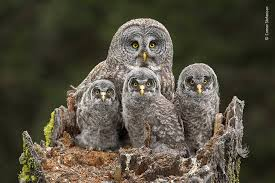

The birds are at it again,
arguing about Brexit
from their branches;

the smug song of a starling,
the crows’ cry
of blue murder,

and the inexpert chatter
of a so-called chaffinch.
Across the street,

a dog cocks its leg
against a lamppost
in protest against

the chronic neglect
of the National Health Service.
A leaf lies ignored

on the pavement
it slept on last night,
and dreams of home.

Further out,
in surrounding fields,
cows hold seminars

on the refugee crisis
and the pigs debate
what to do about Syria.

Goats stare bleakly
from desolate crags,
remembering Trump.

Soon it will be time
for the penguins to march
against global warming.

I do what I can
to keep nature at bay,
drown it out

with radio or TV,
find refuge
in the tranquillity of Twitter.

But it’s late now
and outside
I can hear the owls

calling parliament
into session
once more.
